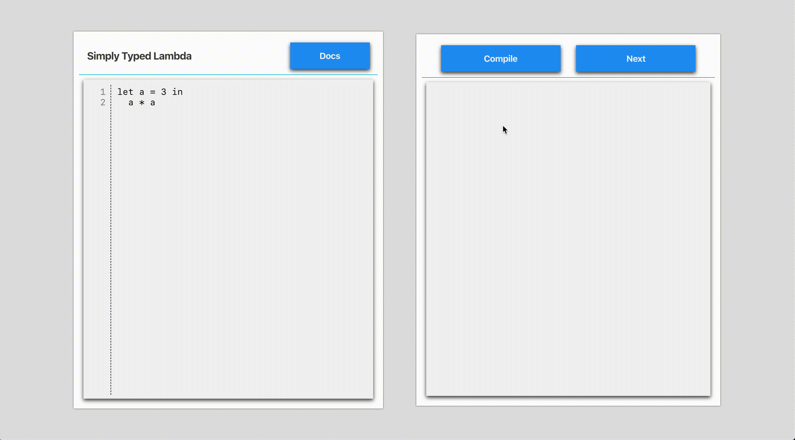

# CS383 Visualization

## Introduction

This project is a website that visualize the evaluation process of the Simply Typed Lambda Calculus under environment model. No dependencies other than a browser is needed since the interpreter is written in TypeScript and then compiled into JavaScript.

The product can be visited at the [Github Pages](https://wunschunreif.github.io/CS383-Visualization/). The Chrome browser is highly recommended. And bugs have been found about line numbering in the Safari browser.

### Demo

(Please wait for the gif to load.)

## How to use

The webpage is divided into 2 blocks, you can write programs in the left side and run the interactive step-by-step evaluator on the right side.

On the grammer of Simply Typed Lambda Calculus, please refer to [Tutorial](./tutorial/Tutorial.md).

After writting the code, you may first click the "Compile" button to compile it. For this procedure, a panel containing the compiling information will appear inside the right area. It has 3 items:

- Parsing status: whether the source code has any syntax problems.
- Typing result: the type of the whole expression if it can be determined.
- Error message: detailed messages about errors if any.

If the source code passed the compilation, you can now click the "Next" button to see the changes of the call stack step-by-step until evaluation finishes. After that, if you wanted to repeat, you have to do the compilation again.

## About the source

### Webpage

The web page is based on React.js. The source for it involves the following directories:

- [`./public`](./public/): automatically generated by `create-react-app`, mainly the HTML templates.
- [`./src`](./src/): the main source of the webpage. It also contains the interpreter code compiled into Javascript, which is not readable.

To build the webpage, you may first install the dependencies suggested by the `package.json` file. Maybe  an `npm install` command will satisfy assuming you already have `Node` and `npm` installed.

### Interpreter

The interpreter's parsing part is based on `antlr4`, which is a fantastic framework of recognition of Context Free Languages. And other parts are written in TypeScript. Its source can be found at [`./interpreter`](./interpreter/).

## Issues

Since this project is finished in a vary rapid speed, there may be some malfunctioning parts when using. If you found any bugs, please talk with me through the issues.

